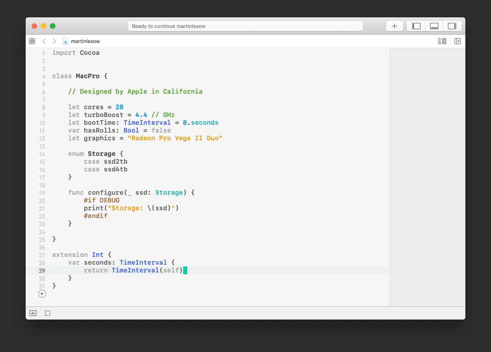

# Xcode Theme by Martin Lexow

A repository containing my personal Xcode themes for macOS light and dark mode. Carefully curated colours and finely tuned contrasts ensure brilliant legibility. Hackathon-proofed.

## How to install
1. Download the `.xccolortheme` files from this repository.
2. Copy the files into:
```
~/Library/Developer/Xcode/UserData/FontAndColorThemes
```
3. Select the theme within Xcodes’ preferences.

## Preview
* **[light theme](previews/preview-light.png)**
* **[dark theme](previews/preview-dark.png)**


